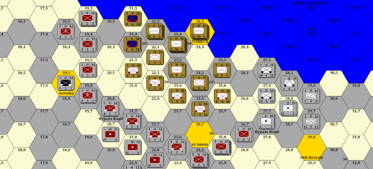

# BWAR

I'm a fan of hex and counter games such as "The Operational Art of War" (TOAW). 

This project is a Javascript implementation of a simple hex game engine that can load and display scenarios from TOAW. It's designed to be a study tool to analyze and learn new scenarios.

I used the following guide when creating this project:

* https://www.redblobgames.com/grids/hexagons/


I also made use of the SVG.JS library:

* https://svgjs.dev/docs/3.0/

# Live demo

A live demo can be viewed at:

* __https://exquisite-stroopwafel-f79422.netlify.app/__


# Scenarios

The project includes the scenario "Crusader41" based on the Siege of Tobruk from WW2. 

A future version of this project will include additional scenarios.


# Interface

## Main Window

* Click a unit or hex to select it
* Double Click a stack to cycle units
* Drag to pan view, mouse wheel to zoom
* If unit movement enabled, right click to move selected unit

## Unit Fields

* Top three fields: AntiAir, Unit Size, Movement
* Bottom three fields: AntiPersonnel, AntiTank, Defense

## Options

* Unit movement slider toggles unit movement on and off
* Overlays show how much power each side projects on nearby hexes
* HQ to Top causes all Headquarter units to move to the top of their unit stack

## Order of Battle (OOB)

* Clicking a side will expand it and show the formations
* Clicking formation will expand it and show the units
* Clicking on a unit on the OOB will zoom to that unit on the map
* Clicking a unit on the map will select it on the OOB

# Counter Drawing

Counters are drawn by the __NatoUnitIcons__ class. The class contains a list of recipes for drawing each type of counter. 

The recipes use convinence variables such as __h__ for icon height and __w__ for icon width. Everything is expressed in terms of a percentage of height or width, such as a line from "25% of width" to "75% of width" at "50% of height".

## Infantry

```
case 'Infantry':
    svgGroupHandle.line(0 + ra, 0 + ra, w - ra, h - ra)
        .stroke({ color: drawColor, opacity: 1.0, width: 1 })
    svgGroupHandle.line(0 + ra, h - ra, w - ra, 0 + ra)
        .stroke({ color: drawColor, opacity: 1.0, width: 1 })
```

## Fighter

```
// Fighter
case 'Fighter':
    bw = 0.01   // vertical body line width
    svgGroupHandle.path(`M${w * 0.25} ${h * 0.33} H${w - w * 0.25} L${w / 2} ${h / 2} Z ` +   // Wings
        `M${w / 2 - w * bw} ${h * 0.2} H${w / 2 + w * bw} V${h * 0.8} H${w / 2 - w * bw} Z ` + // Body
        `M${w / 2 - w * bw * 7} ${h * 0.8} H${w / 2 + w * bw * 7} L${w / 2} ${h * 0.7} Z` + // Tail
        `M${w * 0.4} ${h * 0.33} V${h * 0.26} M${w * 0.6} ${h * 0.33} V${h * 0.26}` // engines
    )
        .stroke({ color: drawColor, opacity: 1.0, width: 1 })
        .fill(drawColor)
```

# License
This program is free software: you can redistribute it and/or modify it under the terms of the GNU General Public License as published by the Free Software Foundation, either version 3 of the License, or (at your option) any later version.

This program is distributed in the hope that it will be useful, but WITHOUT ANY WARRANTY; without even the implied warranty of MERCHANTABILITY or FITNESS FOR A PARTICULAR PURPOSE. See the GNU General Public License for more details.

You should have received a copy of the GNU General Public License along with this program. If not, see <https://www.gnu.org/licenses/>. 

# Source

https://github.com/brianb72
